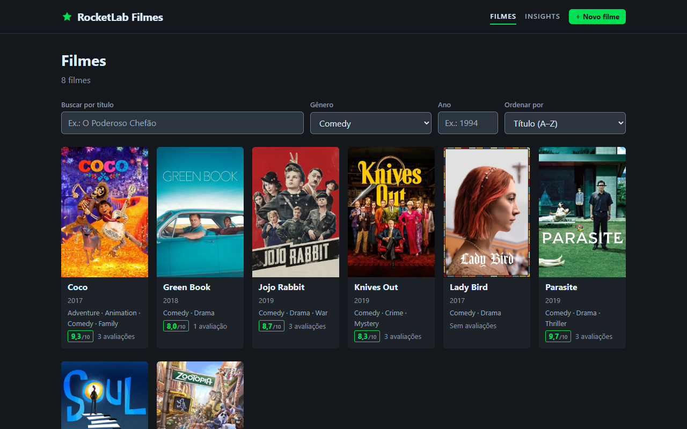
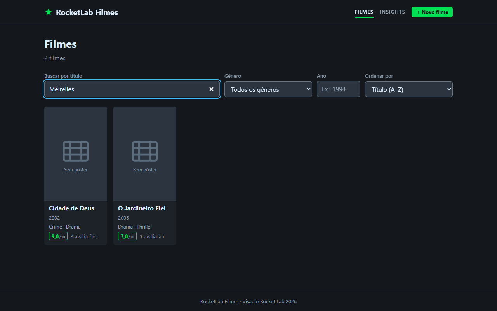
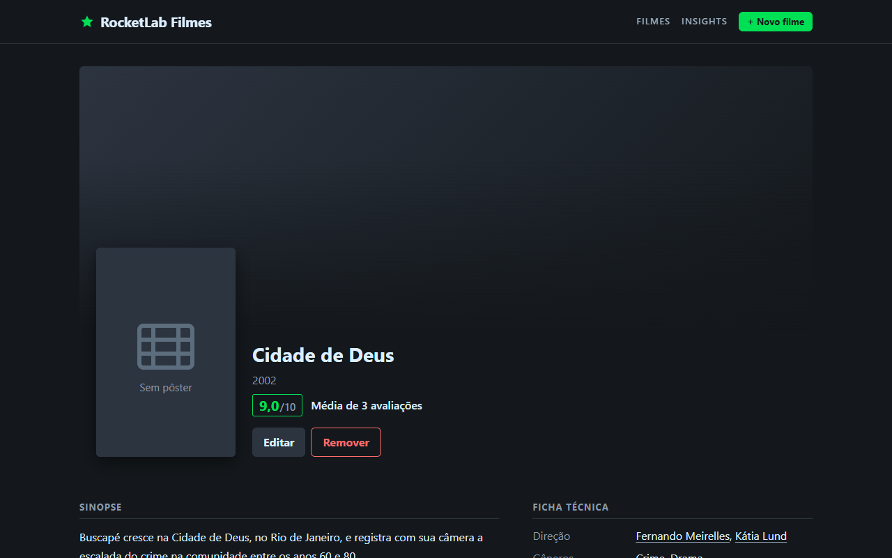
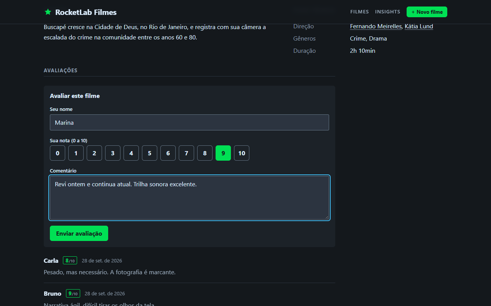
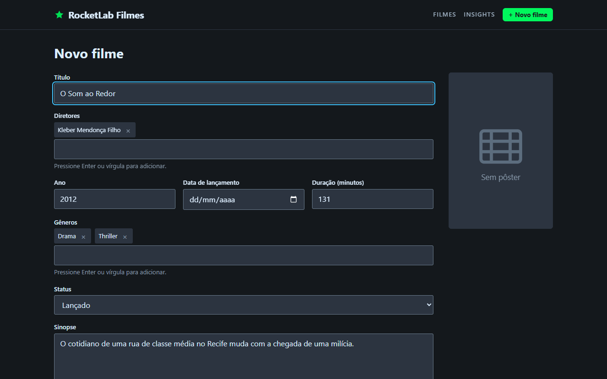
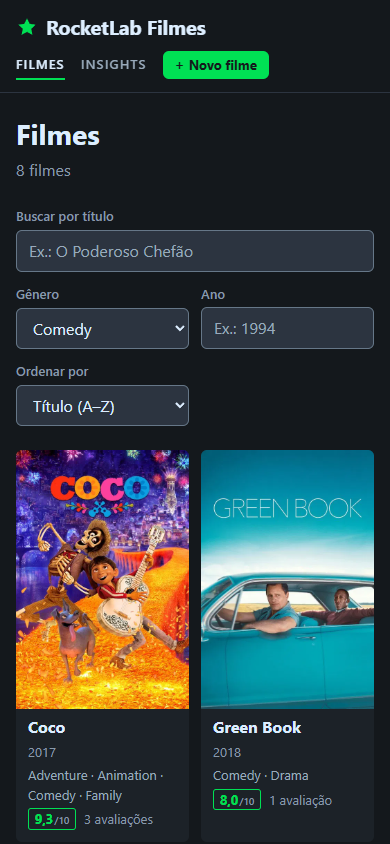
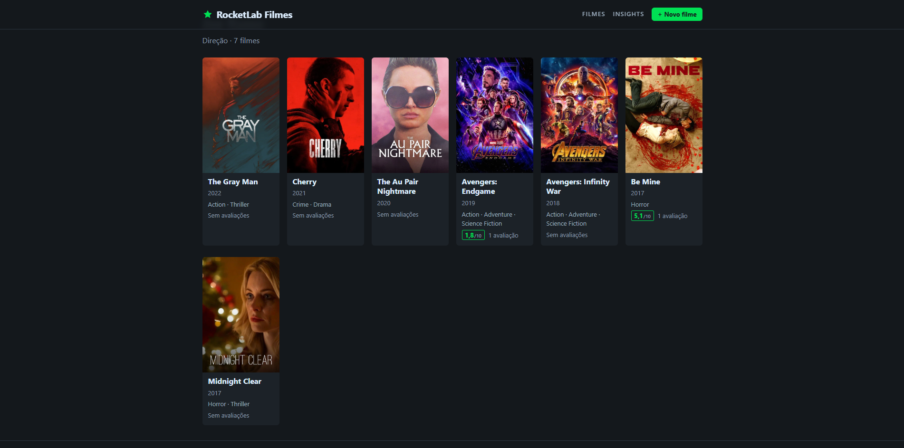
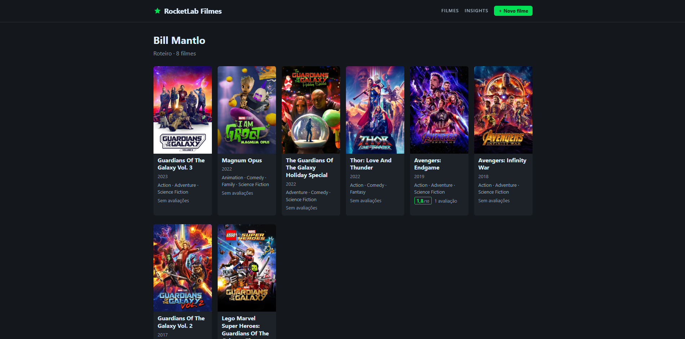
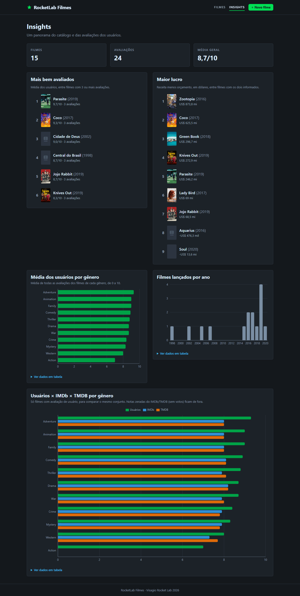

# RocketLab Filmes — Sistema de Avaliação de Filmes

Projeto do **Visagio Rocket Lab 2026**: um catálogo de ~95 mil filmes com busca,
cadastro e avaliações. O usuário é o administrador do catálogo (não há login).

[](https://github.com/AdrianMichael5/rocketlab2026-2/actions/workflows/ci.yml)


## 📽️ Screencast

<div align="center">

[](https://youtu.be/iwsAKXBI-tk)

*Clique na imagem para assistir à demonstração completa no YouTube*

</div>

## Sumário

1. [Início rápido com Docker](#início-rápido-com-docker)
2. [Requisitos atendidos](#requisitos-atendidos)
3. [Funcionalidades extras](#funcionalidades-extras)
4. [Telas](#telas)
5. [Decisões técnicas](#decisões-técnicas)
6. [Stack](#stack)
7. [Execução manual](#execução-manual)
8. [Testes](#testes)
9. [Referência](#referência): [arquitetura](#arquitetura), [endpoints da API](#endpoints-da-api),
   [variáveis de ambiente](#variáveis-de-ambiente) e [scripts](#scripts)

## Início rápido com Docker

Precisa só do **Docker com Compose v2** e dos CSVs de dados em `backend/data/` (os
arquivos estão listados no [passo 4 da execução manual](#backend)). Da raiz do
repositório:

```bash
docker compose up --build -d                                 # 1. sobe API e frontend
docker compose run --rm backend python -m scripts.seed       # 2. carrega os dados (1ª vez)
```

3. Acesse <http://localhost:5173> (API em <http://localhost:8000>, Swagger em `/docs`).

Sem Docker, veja a [execução manual](#execução-manual) (Windows e Linux/Mac).

<details>
<summary><b>Mais sobre o Docker</b> (serviços, dados, comandos úteis, URL da API)</summary>

O `docker-compose.yml` da raiz sobe o backend e o frontend sem precisar instalar
Python ou Node na máquina.

| Serviço | Imagem | Endereço |
|---|---|---|
| `backend` | `python:3.12-slim` + uvicorn | <http://localhost:8000> (Swagger em `/docs`) |
| `frontend` | build com `node:22`, servido pelo `nginx` | <http://localhost:5173> |

**CSVs.** São os mesmos arquivos do passo 4 do backend. A pasta `backend/data/` é
montada no container como **somente leitura**.

**Banco e migrações.** Ao iniciar, o backend roda `alembic upgrade head` antes do
servidor. O banco SQLite fica no volume nomeado `db-data`, então os dados continuam lá
depois de `docker compose down`.

**Seed.** Roda sob demanda, só na primeira vez ou para recarregar tudo. Leva cerca de 1
a 2 minutos (~1,7 milhão de linhas). O seed apaga e recarrega as tabelas, então rode
com a aplicação sem uso. As migrações também rodam antes do seed, então ele funciona
mesmo com o volume vazio.

**Comandos úteis**

```bash
docker compose logs -f backend                 # acompanhar os logs da API
docker compose down                            # parar (mantém o banco)
docker compose down -v                         # parar e apagar o banco (volume db-data)
```

**URL da API no frontend.** O Vite grava `VITE_API_URL` no bundle durante o build, então
a variável é um *build arg* (padrão `http://localhost:8000/api/v1`, o endereço que o
**navegador** usa para chegar na API). Para trocar, refaça a imagem do frontend:

Windows (PowerShell):

```powershell
$env:VITE_API_URL = "http://meu-host:8000/api/v1"; docker compose build frontend
```

Linux/Mac:

```bash
VITE_API_URL=http://meu-host:8000/api/v1 docker compose build frontend
```

Se mudar a origem do frontend, ajuste também `BACKEND_CORS_ORIGINS` no
`docker-compose.yml`.

**Variáveis no Docker.** O backend não lê o `backend/.env` dentro do container: o
`docker-compose.yml` define `DATABASE_URL` (banco em `/app/db/rocketlab.db`, no volume) e
`BACKEND_CORS_ORIGINS`. As demais [variáveis do backend](#variáveis-de-ambiente) usam
os valores padrão. Para mudar alguma, acrescente-a em `services.backend.environment`.

> **Windows:** o `.gitattributes` mantém o `docker-entrypoint.sh` com fim de linha LF
> mesmo em clones no Windows. Se o container do backend falhar com
> `exec ./docker-entrypoint.sh: no such file or directory`, o arquivo foi salvo com CRLF
> por algum editor: converta-o de volta para LF e refaça a imagem.

> As portas 8000 e 5173 são as mesmas do ambiente local: pare o `uvicorn` e o
> `npm run dev` antes de subir os containers.

</details>

## Requisitos atendidos

Cada requisito do enunciado, onde encontrá-lo na interface e na API (rotas da API sob
`/api/v1`; detalhes em [Endpoints da API](#endpoints-da-api)).

| Requisito | No app | Na API |
|---|---|---|
| **Cadastrar filme** | Botão "Novo filme" no topo → `/filmes/novo`. Diretores e gêneros entram como etiquetas; os já existentes são reaproveitados pelo nome | `POST /movies` |
| **Catálogo paginado** | Página inicial `/`, 24 filmes por página, com filtros por gênero e ano e ordenação por título, ano ou nota. O estado fica na URL: dá para compartilhar o link ou usar o Voltar do navegador | `GET /movies?page=&page_size=` → `{items, total, page, page_size}` |
| **Detalhes com avaliações** | `/filmes/:id`: sinopse, elenco, ficha técnica (direção, gêneros, duração, roteiro, produtoras), bilheteria, notas externas (TMDB/IMDb) e a lista de avaliações, mais recentes primeiro | `GET /movies/{sk_movie_id}` e `GET /movies/{sk_movie_id}/reviews` |
| **Busca** | Campo de busca do catálogo, por título, diretores e atores ([busca full-text](#busca-full-text-fts5)) | `GET /movies?q=` |
| **Atualizar e remover filme** | Botões "Editar" (`/filmes/:id/editar`) e "Remover" no detalhe; a remoção pede confirmação | `PATCH /movies/{sk_movie_id}` e `DELETE /movies/{sk_movie_id}` |
| **Nova avaliação** | Formulário "Avaliar este filme" no detalhe: nome, nota de 0 a 10 e comentário | `POST /movies/{sk_movie_id}/reviews` (remoção: `DELETE /reviews/{id}`) |
| **Média das avaliações** | Nota média ("7,5/10") e quantidade no detalhe e nos cards do catálogo, atualizadas na hora | `nota_media` e `qtd_avaliacoes` na lista e no detalhe, [recalculadas na mesma transação](#dim_reviews-recalculada-em-vez-de-carregada-do-csv) |

## Funcionalidades extras

Além do que o enunciado pede:

- **Busca full-text (FTS5)** por título, diretores e atores, sem diferenciar acentos nem
  maiúsculas, pelo início das palavras ("pod chef" → "O Poderoso Chefão").
  [Detalhes](#busca-full-text-fts5).
- **Painel de insights** (link "Insights" no topo, `/insights`; `GET /stats`): números
  gerais, top 10 por média e por lucro, média por gênero, filmes por ano e usuários ×
  IMDb × TMDB, em gráficos com tabela de dados alternativa.
  [Detalhes](#insights-agregações-no-sql-e-regras-sobre-os-dados).
- **Filmografia de pessoas** (`/pessoas/:id`; `GET /people/{id}`): clique em um diretor,
  ator ou roteirista no detalhe para ver os filmes dele, do mais recente ao mais antigo,
  com pôster e média. Quem dirige e atua tem duas páginas (`dim_people` é única por
  nome + papel).
- **Cache em memória com invalidação** de `GET /movies`, `/stats` e `/genres` por 60 s,
  limpo a cada escrita (`CACHE_ENABLED`, `CACHE_TTL_SECONDS`).
  [Detalhes](#cache-em-memória).
- **Script de benchmark** que mede um endpoint com e sem cache, direto no app, sem
  servidor ([scripts do backend](#scripts-do-backend)).
- **Docker Compose**: backend (com migrações automáticas) e frontend (nginx) sem
  instalar Python nem Node ([início rápido](#início-rápido-com-docker)).
- **CI no GitHub Actions** a cada push ou PR na `main`: `ruff` + `pytest` no backend,
  `lint` + `build` no frontend; o selo no topo mostra o estado da `main`.
- **Storybook** de `Rating`, `MovieCard`, `Pagination` e `MovieForm` com dados mockados,
  sem precisar da API ([Storybook](#storybook)).
- **Testes E2E e de acessibilidade**: Playwright nos fluxos principais + axe (WCAG 2.2 AA)
  em 320px, 768px e 1280px e navegação só pelo teclado
  ([Testes E2E](#testes-e2e-playwright)).
- **Capturas de tela e GIF gerados por script**: `npm run screenshots` refaz as imagens
  de [Telas](#telas) e o GIF de demonstração com o Playwright
  ([scripts do frontend](#scripts-do-frontend)).
- **Acessível e responsivo**: WCAG 2.2 AA, uso completo pelo teclado, título de aba por
  página, contraste verificado.

## Telas

Geradas por `npm run screenshots` (em `frontend/`) e salvas em `docs/images/`.

<table>
  <tr>
    <td width="50%"><b>Catálogo</b> (filtrado por gênero)<br></td>
    <td width="50%"><b>Busca</b> por diretor<br></td>
  </tr>
  <tr>
    <td><b>Detalhe do filme</b> com média das avaliações<br></td>
    <td><b>Nova avaliação</b><br></td>
  </tr>
  <tr>
    <td><b>Cadastro de filme</b><br></td>
    <td><b>Catálogo no celular</b> (390×844)<br></td>
  </tr>
   <tr>
    <td><b>Lista de filmes por Diretor</b><br></td>
    <td><b>Lista de filmes por Roteirista</b><br></td>
  </tr>
  <tr>
    <td colspan="2"><b>Insights</b><br></td>
  </tr>
</table>

## Decisões técnicas

### Nota de 0 a 10 em todo o sistema

O enunciado cita, como exemplo, notas de 1 a 5 estrelas. Os dados recebidos
(`movies_reviews.csv`) usam a escala **0 a 10**, e a tabela tem uma `CHECK` com esse
intervalo. Trocar a escala exigiria converter as avaliações existentes e perderia
precisão (há notas como 9,8). Por isso o sistema inteiro usa **0 a 10**: (citado pela organização do Rocket)

- **Banco e API**: o POST de avaliação aceita de 0 a 10 em múltiplos de 0,5 (`7.3` → 422).
  As notas antigas do CSV, como 9,8, continuam válidas.
- **Formulário**: a nota é escolhida entre os inteiros de 0 a 10, em um grupo de opções
  que também funciona pelo teclado (setas).
- **Exibição**: cada avaliação mostra a nota como "8/10"; a média do filme aparece com uma
  casa decimal ("7,5/10"), no catálogo e no detalhe.

### `dim_reviews` recalculada em vez de carregada do CSV

`dim_reviews.csv` (quantidade e média de avaliações por filme) **não bate** com as
avaliações individuais de `movies_reviews.csv`. Comparando os dois arquivos:

| Problema | Filmes afetados |
|---|---|
| Filme com avaliações que não aparece no `dim_reviews.csv` | 14.561 (de 40.267 avaliados) |
| Quantidade de avaliações diferente | 4.503 |
| Mesma quantidade, mas média diferente | 4.091 |

Por isso o seed **ignora** `dim_reviews.csv` e, depois de carregar `movie_reviews`,
recalcula o resumo com `COUNT` e `ROUND(AVG, 2)`: 40.267 filmes com resumo. A mesma
regra é aplicada pela API: criar ou remover uma avaliação recalcula o resumo daquele
filme **na mesma transação**. Assim, a média exibida nunca diverge das avaliações.

### Diretores como lista

Diretor não é uma coluna de `dim_movies`. É uma pessoa em `dim_people` com
`tipo_pessoa = "Diretor"`, ligada ao filme por `bridge_movie_person`. Como a ponte
permite vários diretores por filme (e **9.380 filmes** dos dados têm mais de um), a
API expõe `diretores: list[str]` em vez de um campo único. Assim nenhum dado é
descartado.

- **Ao salvar**, cada nome é procurado em `dim_people` (única por nome + tipo) e
  reaproveitado; só nomes novos são criados. Gêneros seguem a mesma ideia, por nome
  e sem diferenciar maiúsculas ("drama" usa o "Drama" existente).
- **No PATCH**, enviar `diretores` substitui a lista inteira (`[]` limpa). Atores e
  roteiristas do filme são preservados.

### Inserção em lote no seed

O volume é grande: 95 mil filmes, 424 mil pessoas e 745 mil vínculos filme–pessoa. O
ORM linha a linha (`session.add` por registro) levaria dezenas de minutos e muita
memória. O seed usa então:

- **`INSERT` do SQLAlchemy Core** com várias linhas por comando, em **lotes de 5.000**,
  lendo cada CSV em streaming (sem carregar o arquivo inteiro na memória);
- **uma única transação** para toda a carga: ou entra tudo, ou nada;
- **conversões na leitura**:
  - string vazia vira `NULL`;
  - `qtd_tmdb`/`qtd_imdb` chegam como float (`"2375.0"`) e viram inteiro;
  - `data_lancamento` vira `date`;
  - aspas extras no início e no fim das sinopses são removidas;
- **ordem de dependências**: dimensões → pontes → fato → avaliações → recálculo de
  `dim_reviews`.

Resultado: a carga completa leva cerca de 3 minutos.

### Busca full-text (FTS5)

`?q=` usa uma tabela virtual **SQLite FTS5** (`movies_fts`) com título, diretores e
atores de cada filme (roteiristas ficam de fora). O tokenizer `unicode61` com
`remove_diacritics 2` ignora acentos e maiúsculas: "chefao" encontra "Chefão".

- **Prefixo de palavra, todas as palavras:** cada palavra digitada vira `"palavra"*`
  e todas precisam casar ("pod chef" encontra "O Poderoso Chefão"). Diferente do LIKE
  anterior, um trecho no meio da palavra ("hefão") não encontra mais nada.
- **Entrada do usuário nunca vira sintaxe do FTS:** o texto é quebrado em palavras e
  cada uma vai entre aspas, então `OR`, `NEAR`, `-` ou `"` são só texto
  (`app/movies/search.py`).
- **Palavras de uma letra precisam casar exatamente**, sem prefixo: "X-Men" vira
  `"X" "Men"*` e "Rocky V" vira `"Rocky"* "V"`. Como prefixo, uma letra casaria com
  quase todo o catálogo. Palavras repetidas são descartadas e só as 10 primeiras entram
  na busca, o que limita o custo de `q` longos.
- **Continua no LIKE por trecho do título** quando `q` tem menos de 2 caracteres, só
  pontuação ou palavras de uma letra ("E.T."), ou tem caracteres chineses, japoneses ou
  coreanos: o `unicode61` não separa palavras nesses idiomas, então "神隠し" só acha
  "千と千尋の神隠し" pelo LIKE.
- **Filtros e paginação iguais:** o FTS entra como `sk_movie_id IN (subconsulta)`,
  combinável com `genero`, `ano` e `ordem`, sem duplicar filmes nem mudar o `total`.
  Os resultados seguem a `ordem` pedida, não a relevância.
- **Criação e sincronização:** a migração `0004` cria a tabela e a preenche com os
  dados existentes (~26 s na base completa, +53 MB); criar, editar ou remover um filme
  regrava a linha dele no índice na mesma transação; o seed reconstrói o índice ao
  final. Mudanças feitas direto no banco não atualizam o índice.
- **Desempenho (base completa, sem cache):** buscas seletivas ficaram bem mais rápidas
  ("spielberg" ~6 ms e "star wars" ~7 ms, contra ~100 ms do LIKE). Palavras muito
  comuns ficaram mais lentas ("the", 23 mil filmes: ~170 ms contra ~60 ms). Nesses
  casos, com `ordem=titulo`, a página percorre o índice de título em vez de ordenar
  todos os resultados (sem isso, "the" levava ~750 ms).

### Insights: agregações no SQL e regras sobre os dados

`GET /stats` faz todas as contas no banco (`COUNT`, `AVG`, `SUM`, `GROUP BY`,
`ORDER BY … LIMIT 10`); o Python só monta a resposta. Os dados pediram algumas regras:

- **Top 10 por lucro só entre filmes com orçamento e receita informados.** Sem um
  deles, o `lucro_usd` do CSV é a própria receita (ou −orçamento), o que colocaria no
  ranking filmes cujo custo é desconhecido.
- **Notas IMDb/TMDB iguais a 0 ficam fora das médias** (`NULLIF`): no CSV, 0 significa
  "sem votos" (36 mil filmes no TMDB).
- **A comparação usuários × IMDb × TMDB usa só filmes com avaliação de usuário**, para
  as três médias falarem do mesmo conjunto. A média dos usuários é ponderada por
  avaliação (soma das notas / quantidade).
- **Top 10 por média** exige 3 ou mais avaliações; empates vão para quem tem mais
  avaliações e depois para o título.
- **Desempenho:** a migração `0003` cria índices de cobertura em
  `movie_reviews(sk_movie_id, nota)` e `fact_movies_performance(sk_movie_id, nota_imdb,
  nota_tmdb)` e roda `ANALYZE` (o seed também roda); sem as estatísticas o SQLite
  ignora esses índices. Com a base completa, o endpoint caiu de ~1 s para ~0,3 s.
- **Gráficos com Recharts**, carregados só na rota `/insights` (chunk separado). As
  cores das séries são os matizes do tema escurecidos e validados para daltonismo; cada
  gráfico tem a tabela de dados equivalente.

### Cache em memória

As três leituras mais repetidas passam por um cache em memória do próprio processo
(`app/core/cache.py`), sem Redis nem dependência nova: `GET /movies`, `GET /stats` e
`GET /genres`.

- **O que fica guardado:** a resposta já montada pelo service, por **60 s**
  (`CACHE_TTL_SECONDS`).
- **Chave:** endpoint + parâmetros **já validados** (`q`, `genero`, `ano`, `ordem`,
  `page`, `page_size`). Assim, `/movies` e `/movies?page=1&page_size=20` usam a mesma
  entrada. Requisições inválidas (422) nem chegam ao cache.
- **Invalidação:** criar, editar ou remover filme e criar ou remover avaliação limpam
  o cache inteiro **depois do commit**. Qualquer uma dessas escritas afeta os três
  endpoints: uma avaliação muda a média na lista, a ordenação por nota e o `/stats`; um
  filme novo pode trazer um gênero novo. Com um só administrador escrevendo, invalidar
  só parte do cache não compensa a complexidade.
- **Leitura que cruza uma escrita:** se uma escrita termina enquanto uma leitura ainda
  consulta o banco, o resultado dessa leitura não é guardado. Um contador de gerações
  impede que um dado antigo volte para o cache.
- **Memória limitada:** no máximo 512 entradas. Quando o limite é atingido, saem
  primeiro as expiradas e depois a mais antiga.
- **No frontend**, o React Query considera os dados frescos por **30 s** (`staleTime`).
  Nesse intervalo, trocar de página e voltar nem chama a API. Depois disso, a nova
  consulta tende a cair no cache do backend.

Limitações conhecidas:

- O cache é **por processo**. Com vários workers do uvicorn, cada um teria o seu, e a
  invalidação só valeria no worker que recebeu a escrita. Hoje a API roda com um
  worker; para escalar, o caminho seria um cache compartilhado (Redis).
- Mudanças feitas **fora da API** (rodar o seed com o servidor no ar, editar o banco à
  mão) aparecem em até 60 s.
- Várias requisições simultâneas com a mesma chave ainda não guardada consultam o banco
  ao mesmo tempo. Com esse volume de acessos, não vale a pena coordenar isso.

**Medição.** O script `backend/scripts/benchmark.py` chama o app direto via
`httpx.ASGITransport`, sem servidor nem rede. Por isso os tempos medem só o trabalho da
API. O script faz 20 chamadas com o cache desligado e depois 20 com o cache ligado
(começando vazio, então a primeira é um miss):

```bash
cd backend
python -m scripts.benchmark                                    # GET /api/v1/movies, 20 chamadas
python -m scripts.benchmark --path "/api/v1/stats" --calls 50  # outro endpoint
```

Resultados com a base completa (95 mil filmes), Python 3.12, Windows 11, SQLite local.
Média de 20 chamadas:

| Requisição | Sem cache | Com cache | Ganho |
|---|---:|---:|---:|
| `GET /movies` (1ª página, padrão)¹ | 5,8 ms | 1,3 ms | ~4× |
| `GET /movies?q=star&ordem=nota` | 103,1 ms | 6,6 ms | ~16× |
| `GET /movies?genero=Drama&page=50` | 197,1 ms | 10,8 ms | ~18× |
| `GET /stats` | 274,5 ms | 13,8 ms | ~20× |
| `GET /genres` | 2,5 ms | 1,0 ms | ~2,5× |

¹ Média de 3 execuções (5,9 / 5,6 / 5,8 ms sem cache; 1,2 / 1,4 / 1,4 ms com cache).

A média com cache inclui a primeira chamada, que é um miss e custa o mesmo que sem
cache. A mediana mostra o custo de um acerto: cerca de **1 ms** em todos os endpoints,
já que sobra só a serialização da resposta. O ganho é maior justamente nas consultas
caras (busca, filtros, páginas distantes e `/stats`), que são as mais repetidas pelo
catálogo e pela página de insights.

### Outras decisões

- **Paginação no servidor** com resposta `{items, total, page, page_size}`, em vez de
  devolver 95 mil filmes de uma vez.
- **`duracao_minutos = 0`** significa duração desconhecida (é o que os dados usam) e
  aparece como "—".
- **Filmes sem pôster** (~8 mil) ou com imagem quebrada mostram um pôster genérico.
- **Remoção em cascata** (`ON DELETE CASCADE`): remover um filme apaga avaliações,
  resumo, métricas e vínculos, mas mantém pessoas, gêneros e produtoras, que podem
  estar em outros filmes.
- **Escritas concorrentes** que violariam unicidade (dois cadastros simultâneos
  criando o mesmo gênero novo, por exemplo) são barradas pelo banco e devolvem **409**
  em vez de erro 500.
- **Sem biblioteca de UI**: tema escuro em variáveis CSS e CSS Modules. As cores foram
  checadas quanto a contraste (texto ≥ 4,5:1, contornos de campos ≥ 3:1).
- **Schema só pelo Alembic**, nunca por `create_all`.
- **Organização por domínio** no backend e no frontend (ver [Arquitetura](#arquitetura)).

## Stack

**Backend:** Python 3.11+, FastAPI, SQLAlchemy 2.0 (async), Alembic, Pydantic 2, SQLite (aiosqlite) · **Frontend:** React 19, TypeScript, Vite, React Router, TanStack Query, Recharts, CSS Modules.<br>
**Testes:** pytest + httpx; Vitest + Testing Library; Playwright + axe-core (E2E e acessibilidade) · **Qualidade:** Ruff (backend), ESLint + `tsc` (frontend).

## Execução manual

Os comandos abaixo partem da raiz do repositório. Onde o comando muda entre sistemas,
há uma versão para **Windows (PowerShell)** e outra para **Linux/Mac**.

### Pré-requisitos

- **Python 3.11 ou superior**
- **Node.js 22.12 ou superior** (exigência do Vitest 5)
- **Os CSVs de dados** da camada Diamond (não versionados; veja o passo 4 abaixo)
- Para os testes E2E: **Google Chrome** instalado ou o Chromium do Playwright (veja
  [Testes E2E](#testes-e2e-playwright))

Para rodar só com Docker, basta o **Docker com Compose v2** e os CSVs (veja o
[Início rápido](#início-rápido-com-docker)).

### Backend

**1. Criar e ativar o ambiente virtual**

Windows (PowerShell):

```powershell
cd backend
python -m venv .venv
.venv\Scripts\Activate.ps1
```

> Se o PowerShell bloquear o script de ativação, libere para o usuário atual uma única
> vez: `Set-ExecutionPolicy -Scope CurrentUser RemoteSigned`.

Linux/Mac:

```bash
cd backend
python3 -m venv .venv
source .venv/bin/activate
```

Com o ambiente ativado, os comandos dos próximos passos são iguais nos dois sistemas.

**2. Instalar as dependências** (inclui as de teste e lint)

```bash
python -m pip install -e ".[dev]"
```

**3. Criar o `.env`**

Windows: `Copy-Item .env.example .env` · Linux/Mac: `cp .env.example .env`

Os valores padrão já funcionam. As variáveis disponíveis estão em
[Variáveis de ambiente](#variáveis-de-ambiente).

**4. Colocar os CSVs em `backend/data/`**

O seed espera estes arquivos, com estes nomes, direto em `backend/data/`:

```text
backend/data/
├── dim_genres.csv
├── dim_companies.csv
├── dim_people.csv
├── dim_movies.csv
├── bridge_movie_genre.csv
├── bridge_movie_company.csv
├── bridge_movie_person.csv
├── fact_movies_performance.csv
├── movies_reviews.csv
└── dim_reviews.csv        # opcional: é ignorado (veja "Decisões técnicas")
```

Os CSVs estão no `.gitignore` e não vão para o repositório.

**5. Criar as tabelas**

```bash
alembic upgrade head
```

O schema é criado só pelo Alembic, nunca por `create_all`.

**6. Carregar os dados (seed)**

```bash
python -m scripts.seed
```

- **Duração:** carrega ~1,7 milhão de linhas em cerca de **3 minutos** e mostra o progresso
  de cada tabela.
- **Pode rodar de novo:** o seed limpa e recarrega tudo numa única transação. Se algo
  falhar, o banco fica como estava.
- **Cuidado:** avaliações e filmes criados pela aplicação são apagados ao rodar de novo.

**7. Subir a API**

```bash
uvicorn app.main:app --reload
```

- API: <http://localhost:8000>
- Documentação interativa (Swagger): <http://localhost:8000/docs>
- Checagem de saúde: <http://localhost:8000/health>

### Frontend

Em outro terminal, a partir da raiz do repositório:

**1. Instalar as dependências**

```bash
cd frontend
npm install
```

**2. Criar o `.env`** (opcional)

Windows: `Copy-Item .env.example .env` · Linux/Mac: `cp .env.example .env`

A única variável é `VITE_API_URL`, a URL base da API **incluindo** `/api/v1`. Sem o
arquivo, o padrão é `http://localhost:8000/api/v1`.

**3. Subir o servidor de desenvolvimento**

```bash
npm run dev
```

Acesse <http://localhost:5173>. Essa origem já está liberada no CORS do backend.

Para gerar a versão de produção: `npm run build` (sai em `frontend/dist/`).

## Testes

### Backend

Com o ambiente virtual ativado, dentro de `backend/`:

```bash
ruff check .                                   # lint
pytest                                         # 324 testes (API, busca, modelos, seed, cache, concorrência)
pytest --cov=app --cov-report=term-missing     # com cobertura (~99%)
```

Os testes usam SQLite em memória e não tocam no `rocketlab.db`.

### Frontend (unitários e de componentes)

Dentro de `frontend/`:

```bash
npm run lint            # ESLint
npm run build           # checagem de tipos + build
npm test                # 333 testes (Vitest + Testing Library)
npm run test:watch      # reexecuta ao salvar
npm run test:coverage   # com cobertura (~99%)
```

Esses comandos (e os do backend) são os mesmos no Windows e no Linux/Mac. A CI roda
`ruff check .` + `pytest` no backend e `npm run lint` + `npm run build` no frontend.

### Testes E2E (Playwright)

Os testes E2E cobrem os fluxos de ponta a ponta:

- buscar filme, abrir detalhe e avaliar;
- cadastrar, editar e remover filme;
- página da pessoa a partir do detalhe;
- insights (ranking leva ao detalhe do filme);
- acessibilidade (axe) e layout em 320px, 768px e 1280px;
- navegação só pelo teclado.

Dentro de `frontend/`:

```bash
npm run test:e2e        # roda tudo, sem janela
npm run test:e2e:ui     # modo interativo do Playwright
```

**Não é preciso subir nada antes.** O Playwright inicia sozinho:

- uma API na porta **8001**, com um banco descartável (`backend/e2e.db`) criado do zero
  pelo Alembic;
- um frontend na porta **5174**.

O banco de desenvolvimento não é tocado. O único requisito é que o venv do backend
exista (passos 1 e 2 do backend).

Por padrão, os testes usam o **Google Chrome** instalado na máquina. Para usar o
Chromium que acompanha o Playwright (por exemplo, em CI):

Windows (PowerShell):

```powershell
npx playwright install chromium
$env:PW_CHANNEL = "chromium"; npm run test:e2e
```

Linux/Mac:

```bash
npx playwright install chromium
PW_CHANNEL=chromium npm run test:e2e
```

O relatório HTML fica em `frontend/playwright-report/` (`npx playwright show-report`).
As variáveis opcionais dos testes E2E (`PW_CHANNEL`, `E2E_PYTHON`, `E2E_API_PORT`,
`E2E_WEB_PORT`) estão em [Variáveis de ambiente](#variáveis-de-ambiente).

## Referência

<details>
<summary><b>Arquitetura</b> (estrutura de pastas)</summary>

### Arquitetura

```text
.
├── .github/workflows/      # CI: ruff + pytest e lint + build a cada push/PR na main
├── backend/
│   ├── app/
│   │   ├── api/            # dependências comuns (sessão, paginação) e router v1
│   │   ├── core/           # configurações (.env), logging e cache em memória
│   │   ├── db/             # Base ORM, engine e sessões
│   │   ├── movies/         # domínio de filmes: models, schemas, repository, service, router
│   │   ├── reviews/        # domínio de avaliações (mesma divisão em camadas)
│   │   ├── genres/         # listagem de gêneros
│   │   ├── people/         # página da pessoa (GET /people/{id}) com a filmografia
│   │   ├── stats/          # agregações da página de insights (GET /stats)
│   │   └── main.py         # criação da aplicação FastAPI
│   ├── migrations/         # ambiente e revisões do Alembic
│   ├── scripts/            # seed.py (carga dos CSVs) e benchmark.py (tempos com/sem cache)
│   ├── data/               # CSVs (não versionados)
│   ├── tests/              # pytest
│   ├── Dockerfile          # imagem da API (migra ao subir; ver docker-entrypoint.sh)
│   └── docker-entrypoint.sh
├── frontend/
│   ├── src/
│   │   ├── api/            # cliente HTTP tipado, tipos da API, chaves do React Query
│   │   ├── components/     # componentes reutilizáveis (cards, nota, modal, etiquetas…)
│   │   ├── hooks/          # hooks genéricos (debounce, título da aba)
│   │   ├── pages/          # uma página por rota + subpastas por tela
│   │   ├── stories/        # dados mockados e decorators das stories do Storybook
│   │   ├── styles/         # tema (variáveis CSS globais)
│   │   └── test/           # utilitários dos testes (mock da API, render com providers)
│   ├── .storybook/         # configuração do Storybook (react-vite) e CSS global
│   ├── e2e/                # testes Playwright: specs, page objects, capturas e subida da API de teste
│   ├── playwright.config.ts
│   ├── Dockerfile          # build com Node e site estático no nginx
│   └── nginx.conf          # fallback de SPA para as rotas do React Router
├── docs/images/            # capturas de tela e demo.gif do README (npm run screenshots)
├── docker-compose.yml      # backend + frontend (ver "Início rápido com Docker")
└── README.md
```

Backend e frontend são organizados **por domínio**. No backend, cada domínio separa as
camadas de rota, regra de negócio e acesso a dados (`router` → `service` →
`repository`).

</details>

<details>
<summary><b>Endpoints da API</b></summary>

### Endpoints da API

Todas as rotas ficam sob `/api/v1`. A documentação completa, com os schemas, está em
`/docs`.

| Método | Rota | Descrição | Respostas |
|---|---|---|---|
| GET | `/movies` | Lista paginada. Parâmetros: `q` (título, diretores ou atores; ver [Busca full-text](#busca-full-text-fts5)), `genero`, `ano`, `ordem` (`titulo` \| `ano` \| `nota`), `page`, `page_size` (padrão 20, máx. 100) | 200, 422 |
| GET | `/movies/{sk_movie_id}` | Detalhe: dados, diretores, gêneros, elenco, bilheteria, média. `creditos` repete diretores, atores e roteiristas com o `sk_person_id` | 200, 404 |
| POST | `/movies` | Cadastra filme (`titulo` obrigatório; `diretores` e `generos` como listas) | 201, 409, 422 |
| PATCH | `/movies/{sk_movie_id}` | Atualiza só os campos enviados | 200, 404, 409, 422 |
| DELETE | `/movies/{sk_movie_id}` | Remove o filme com avaliações, métricas e vínculos | 204, 404 |
| GET | `/movies/{sk_movie_id}/reviews` | Avaliações paginadas, mais recentes primeiro | 200, 404 |
| POST | `/movies/{sk_movie_id}/reviews` | Cria avaliação (`nome`, `nota`, `comentario`) e recalcula a média | 201, 404, 422 |
| DELETE | `/reviews/{sk_movie_review_id}` | Remove avaliação e recalcula a média | 204, 404 |
| GET | `/people/{sk_person_id}` | Pessoa (`nome`, `tipo`) e `filmes` paginados (`page`, `page_size`), do mais recente ao mais antigo, sem ano por último | 200, 404, 422 |
| GET | `/genres` | Gêneros que têm filmes (para o filtro do catálogo) | 200 |
| GET | `/stats` | Números gerais, rankings e médias por gênero e ano (página de insights) | 200 |
| GET | `/health` | Saúde da aplicação (fora de `/api/v1`) | 200 |

Listagens paginadas devolvem sempre `{ "items": [...], "total", "page", "page_size" }`.
Erros de validação (422) seguem o formato padrão do FastAPI, que o frontend usa para
mostrar a mensagem ao lado do campo certo.

Exemplo de cadastro:

```json
POST /api/v1/movies
{
  "titulo": "Interestelar",
  "ano_lancamento": 2014,
  "duracao_minutos": 169,
  "diretores": ["Christopher Nolan"],
  "generos": ["Ficção científica", "Drama"]
}
```

</details>

<details>
<summary><b>Variáveis de ambiente</b> (backend, frontend e testes E2E)</summary>

### Variáveis de ambiente

**Backend** (`backend/.env`, criado a partir do `.env.example`; os padrões já funcionam):

| Variável | Padrão | Para que serve |
|---|---|---|
| `DATABASE_URL` | `sqlite+aiosqlite:///./rocketlab.db` | Banco de dados (arquivo `backend/rocketlab.db`) |
| `BACKEND_CORS_ORIGINS` | `["http://localhost:5173"]` | Origens liberadas no CORS (a do frontend) |
| `ENVIRONMENT` | `local` | Em `local`, o SQLAlchemy registra cada SQL no console |
| `PROJECT_VERSION` | `2026.2` | Versão exibida no Swagger (`/docs`) |
| `LOG_LEVEL` | `INFO` | Nível de log |
| `CACHE_ENABLED` | `true` | Liga o cache em memória de `GET /movies`, `/stats` e `/genres` |
| `CACHE_TTL_SECONDS` | `60` | Validade de cada entrada do cache (maior que 0; para desligar, use `CACHE_ENABLED`) |

No Docker, o backend não lê esse arquivo (veja "Variáveis no Docker" no
[Início rápido](#início-rápido-com-docker)).

**Frontend** (`frontend/.env`, opcional):

| Variável | Padrão | Para que serve |
|---|---|---|
| `VITE_API_URL` | `http://localhost:8000/api/v1` | URL base da API, **incluindo** `/api/v1`. No Docker é um *build arg* |

**Testes E2E** (opcionais; defina como no exemplo do `PW_CHANNEL` em
[Testes E2E](#testes-e2e-playwright)):

| Variável | Padrão | Para que serve |
|---|---|---|
| `PW_CHANNEL` | `chrome` | Navegador: `chrome` (instalado na máquina) ou `chromium` (do Playwright) |
| `E2E_PYTHON` | Python do `backend/.venv` | Python usado para migrar e subir a API de teste (`.venv\Scripts\python.exe` no Windows, `.venv/bin/python` no Linux/Mac; sem venv, `python` do PATH) |
| `E2E_API_PORT` | `8001` | Porta da API de teste |
| `E2E_WEB_PORT` | `5174` | Porta do frontend de teste |

</details>

<details>
<summary><b>Scripts</b> (backend, frontend e Storybook)</summary>

### Scripts

#### Scripts do backend

Todos rodam de dentro de `backend/`, com o ambiente virtual ativado (os comandos são
iguais no Windows e no Linux/Mac).

| Comando | Para que serve |
|---|---|
| `alembic upgrade head` | Cria ou atualiza as tabelas (passo 5) |
| `python -m scripts.seed` | Carrega os CSVs de `backend/data/` (passo 6). Apaga e recarrega tudo |
| `python -m scripts.benchmark` | Mede `GET /api/v1/movies` com e sem cache (20 chamadas de cada) |
| `python -m scripts.benchmark --path "/api/v1/stats" --calls 50` | Mede outro endpoint, com outra quantidade de chamadas |

O benchmark usa o banco configurado no `.env`, então rode o seed antes para ter números
realistas. Os resultados medidos estão em [Cache em memória](#cache-em-memória).

Não há script para criar administrador: o sistema não tem login.

#### Scripts do frontend

Dentro de `frontend/`:

| Comando | Para que serve |
|---|---|
| `npm run dev` | Servidor de desenvolvimento em <http://localhost:5173> |
| `npm run build` | Checagem de tipos + build de produção em `frontend/dist/` |
| `npm run preview` | Serve o build de produção localmente |
| `npm run lint` | ESLint |
| `npm test` / `npm run test:watch` / `npm run test:coverage` | Testes Vitest (uma vez, ao salvar, com cobertura) |
| `npm run test:e2e` / `npm run test:e2e:ui` | Testes Playwright (sem janela / modo interativo) |
| `npm run screenshots` | Refaz as capturas e o `demo.gif` de `docs/images/` (ver abaixo) |
| `npm run storybook` / `npm run build-storybook` | Storybook (ver abaixo) |

**Capturas de tela.** `npm run screenshots` roda `e2e/screenshots.spec.ts` no Playwright,
com a mesma API e o mesmo banco descartável dos testes E2E. O spec cadastra filmes de
exemplo e salva em `docs/images/` o catálogo (1280×800 e 390×844), a busca, o detalhe,
o formulário de avaliação, o cadastro e os insights (página inteira). Os pôsteres vêm
do TMDB, então é preciso estar com internet. Esse spec fica fora de `npm run test:e2e`.

O mesmo comando grava o `demo.gif` (1024×640): busca, detalhe e envio de uma avaliação.
O `e2e/support/gifRecorder.ts` tira screenshots em intervalo fixo durante o fluxo e
monta o GIF em JavaScript (`gifenc` + `pngjs`, sem ffmpeg), com uma paleta única e só
os pixels que mudam entre um frame e outro, o que deixa o arquivo em ~300 KB.

#### Storybook

Catálogo visual dos componentes, isolados do resto do app. As stories usam dados
mockados e **não chamam a API**: não é preciso subir o backend.

```bash
cd frontend
npm run storybook        # http://localhost:6006, recarrega ao editar
npm run build-storybook  # versão estática em frontend/storybook-static/
```

| Story | Estados |
|---|---|
| Components/Rating/Exibição | notas 0, 5,5 e 10; média do filme ("10,0/10"); tamanhos `sm`, `md`, `lg` |
| Components/Rating/Entrada | sem nota, nota escolhida, com erro, desabilitado |
| Components/MovieCard | com e sem pôster, sem avaliações, título longo |
| Components/Pagination | primeira, do meio e última página |
| Pages/MovieForm | vazio, preenchido e com erros de validação |

- A nota é texto de 0 a 10, sem estrelas (ver
  [Nota de 0 a 10 em todo o sistema](#nota-de-0-a-10-em-todo-o-sistema)): as stories
  de nota cobrem a exibição (`Rating`) e a entrada (`NotaInput`).
- O CSS global do app (`src/styles/theme.css`) é aplicado em todas as stories, e um
  `MemoryRouter` envolve cada uma (os cards e o formulário têm links).
- `MovieForm` recebe um `QueryClient` próprio com os gêneros já no cache, sem nenhuma
  busca. Em "com erros de validação", uma função `play` envia o formulário e confere as
  mensagens da validação real.
- O pôster mock é um SVG local (`src/stories/fixtures/`), então as stories funcionam
  sem internet.

Para uma story nova, crie `Componente.stories.tsx` ao lado do componente; os dados
mockados compartilhados ficam em `src/stories/fixtures/`.

</details>
